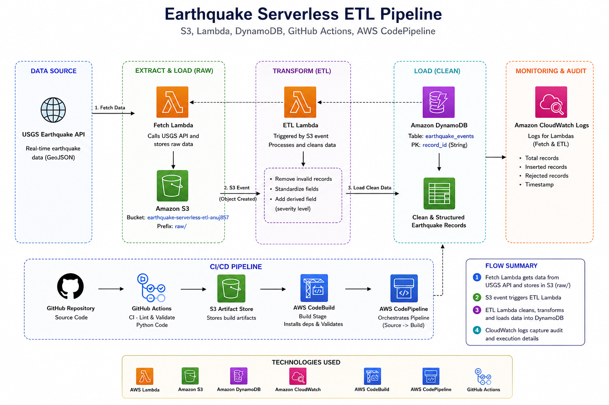
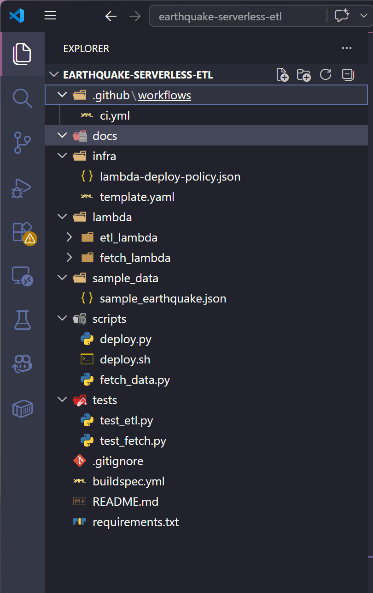
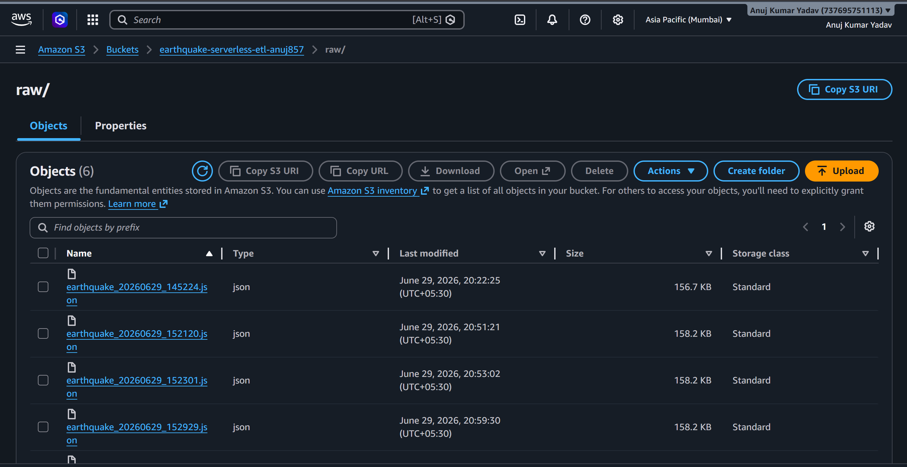
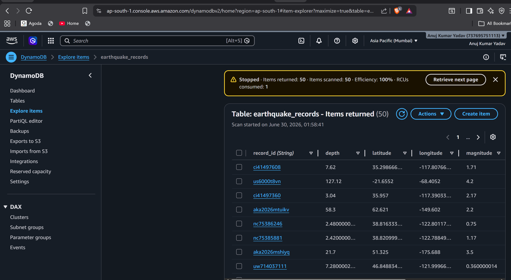
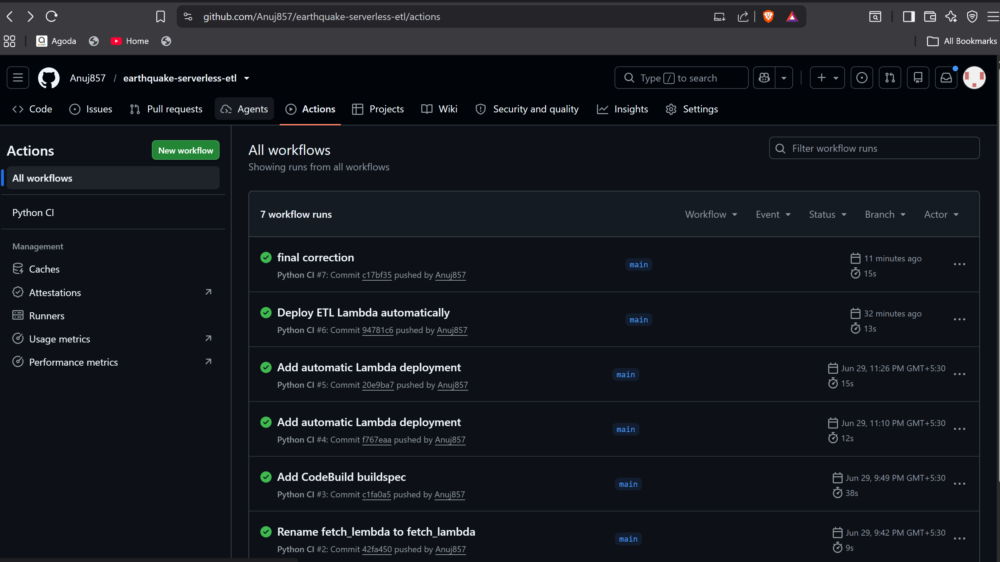
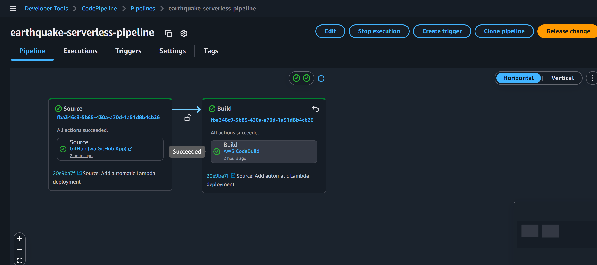

# 🌍 Earthquake Serverless ETL Pipeline with CI/CD



A real-world **Serverless ETL Pipeline** built on AWS that extracts earthquake data from the **USGS Earthquake API**, stores raw data in **Amazon S3**, processes and transforms the data using **AWS Lambda**, loads clean records into **Amazon DynamoDB**, and automates validation and deployment using **GitHub Actions**, **AWS CodeBuild**, and **AWS CodePipeline**.

---

# 📌 Project Overview

This project demonstrates an end-to-end **Serverless Data Engineering Pipeline** using AWS services.

The pipeline performs the following operations:

- Fetches real-time earthquake data from the USGS API
- Stores raw GeoJSON data in Amazon S3
- Automatically triggers an ETL Lambda when a new file arrives
- Cleans and transforms the dataset
- Loads processed records into Amazon DynamoDB
- Logs execution details in Amazon CloudWatch
- Uses GitHub Actions for Continuous Integration (CI)
- Uses AWS CodePipeline & CodeBuild for Continuous Deployment (CD)

---

# 🏗 Project Architecture


---

# 🔄 ETL Workflow

```
USGS Earthquake API
        │
        ▼
Fetch Lambda
        │
        ▼
Amazon S3 (raw/)
        │
        ▼
S3 Event Trigger
        │
        ▼
ETL Lambda
        │
        ▼
Data Cleaning & Transformation
        │
        ▼
Amazon DynamoDB
        │
        ▼
Amazon CloudWatch Logs
```

---

# 🚀 AWS Services Used

| Service | Purpose |
|----------|----------|
| AWS Lambda | Fetch & ETL Processing |
| Amazon S3 | Raw Data Storage |
| Amazon DynamoDB | Clean Data Storage |
| Amazon CloudWatch | Monitoring & Logs |
| AWS IAM | Access Management |
| GitHub Actions | Continuous Integration |
| AWS CodeBuild | Build & Validation |
| AWS CodePipeline | Continuous Deployment |

---

# 📂 Project Structure

```
earthquake-serverless-etl/
│
├── .github/
│   └── workflows/
│       └── ci.yml
│
├── docs/
│   ├── Architecture.png
│   ├── project_folderStructure.png
│   ├── 02_S3_Raw_File.png
│   ├── 04_DynamoDB_Items.png
│   ├── 05_GitHub_Actions.png
│   └── 06_CodePipeline.png
│
├── infra/
│   ├── lambda-deploy-policy.json
│   └── template.yaml
│
├── lambda/
│   ├── fetch_lambda/
│   └── etl_lambda/
│
├── sample_data/
│   └── sample_earthquake.json
│
├── scripts/
│   ├── deploy.py
│   ├── deploy.sh
│   └── fetch_data.py
│
├── tests/
│   ├── test_fetch.py
│   └── test_etl.py
│
├── buildspec.yml
├── requirements.txt
├── README.md
└── .gitignore
```

---

# 📊 Dataset

**Source**

USGS Earthquake API

https://earthquake.usgs.gov/earthquakes/feed/v1.0/summary/all_month.geojson

Dataset Format

- GeoJSON
- Real-time Earthquake Events

---

# ⚙️ ETL Process

## Extract

- Fetch latest earthquake data
- Download GeoJSON
- Store raw data in Amazon S3

---

## Transform

The ETL Lambda performs:

- Remove invalid records
- Remove null magnitudes
- Extract coordinates
- Standardize numeric values
- Create Severity field

### Severity Rules

| Magnitude | Severity |
|-----------|-----------|
| < 2.5 | Minor |
| 2.5 - 5.4 | Moderate |
| 5.5 - 6.9 | Strong |
| ≥ 7.0 | Major |

---

## Load

Load cleaned records into Amazon DynamoDB.

### Table

```
earthquake_events
```

Partition Key

```
record_id
```

---

# 📈 CloudWatch Audit

Each execution records:

- Total Records
- Inserted Records
- Rejected Records
- Timestamp
- Execution Status

---

# 🔄 CI/CD Pipeline

## GitHub Actions (CI)

On every Push:

- Checkout Repository
- Install Dependencies
- Validate Python Syntax
- Run Tests

---

## AWS CodePipeline (CD)

Pipeline Stages

```
GitHub Repository
        │
        ▼
AWS CodePipeline
        │
        ▼
AWS CodeBuild
        │
        ▼
Lambda Deployment
```

---

# 📷 Project Screenshots

## Project Structure



---

## S3 Raw File



---

## DynamoDB Records



---

## GitHub Actions



---

## AWS CodePipeline



---

# ▶️ Running Locally

Clone the repository

```bash
git clone https://github.com/Anuj857/earthquake-serverless-etl.git
```

Install dependencies

```bash
pip install -r requirements.txt
```

Run sample fetch

```bash
python scripts/fetch_data.py
```

---

# 📌 Future Improvements

- EventBridge Scheduler
- SNS Email Notifications
- Dead Letter Queue (DLQ)
- AWS SAM Deployment
- Terraform Support
- Unit Test Coverage
- Lambda Versioning & Aliases

---

# 👨‍💻 Author

**Anuj Kumar Yadav**

B.Tech Computer Science Engineering

Data Engineering Enthusiast

GitHub

https://github.com/Anuj857

LinkedIn

https://www.linkedin.com/in/anujkqr/

---
 
# ⭐ If you like this project, don't forget to star the repository.